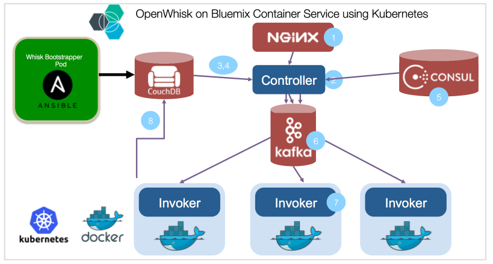

[](https://travis-ci.org/IBM/kubernetes-container-service-cassandra-deployment)

# Scalable OpenWhisk on Bluemix Container Service using Kubernetes

This code demonstrates the deployment of OpenWhisk on Kubernetes cluster. Apache OpenWhisk is a serverless, open source cloud platform that executes functions in response to events at any scale. As a developer there's no need to manage the servers that run your code. Apache OpenWhisk operates and scales your application for you. 

With IBM Bluemix Container Service, you can deploy and manage your own Kubernetes cluster in the cloud that lets you automate the deployment, operation, scaling, and monitoring of containerized apps over a cluster of independent compute hosts called worker nodes.  We can then leverage Bluemix Container Service using Kubernetes to deploy scalable OpenWhisk.



## Included Components
- [OpenWhisk](http://openwhisk.org/)
- [Kubernetes Clusters](https://console.ng.bluemix.net/docs/containers/cs_ov.html#cs_ov)
- [Bluemix container service](https://console.ng.bluemix.net/catalog/?taxonomyNavigation=apps&category=containers)
- [Bluemix DevOps Toolchain Service](https://console.ng.bluemix.net/catalog/services/continuous-delivery)

## Kubernetes Concepts Used

- [Kubenetes Pods](https://kubernetes.io/docs/user-guide/pods)
- [Kubenetes Services](https://kubernetes.io/docs/user-guide/services)
- [Kubernetes Jobs](https://kubernetes.io/docs/concepts/workloads/controllers/jobs-run-to-completion/)
- [Kubernets StatefulSets](https://kubernetes.io/docs/concepts/workloads/controllers/statefulset/)

## Prerequisite

Create a Kubernetes cluster with either [Minikube](https://kubernetes.io/docs/getting-started-guides/minikube) for local testing, or with [IBM Bluemix Container Service](https://github.com/IBM/container-journey-template) to deploy in cloud. The code here is regularly tested against [Kubernetes Cluster from Bluemix Container Service](https://console.ng.bluemix.net/docs/containers/cs_ov.html#cs_ov) using Travis.

## Deploy to Bluemix
If you want to deploy OpenWhisk directly to Kubernetes cluster on Bluemix,  click on 'Deploy to Bluemix' button below to create a Bluemix DevOps service toolchain and pipeline for deploying the WordPress sample, else jump to [Steps](#steps)

> You will need to create your Kubernetes cluster first and make sure it is fully deployed in your Bluemix account.

[](https://console.ng.bluemix.net/devops/setup/deploy/?repository=https://github.com/IBM/kubernetes-container-service-cassandra-deployment)

Please follow the [Toolchain instructions](https://github.com/IBM/container-journey-template/blob/master/Toolchain_Instructions.md) to complete your toolchain and pipeline.

The OpenWhisk will not be exposed on the public IP of the Kubernetes cluster. You can still access them by exporting your Kubernetes cluster configuration using `bx cs cluster-config <your-cluster-name>` and doing [Step 5](#5-using-cql) or to simply check their status `kubectl exec <POD-NAME> -- nodetool status`

## Prerquisites

- Kubernetes needs to be version 1.5+
- Kubernetes has Kube-DNS deployed
- (Optional) Kubernetes Pods can receive public addresses. This will be required if you wish to reach Nginx from outside of the Kubernetes cluster's network.

```Note: Use the following link to complete the instructions at the bottom
https://github.com/openwhisk/openwhisk-devtools/tree/master/kubernetes
```

## Steps

1. [Download OpenWhisk-Kubernetes codebase](#1-download-openWhisk-kubernetes-codebase)

### Quick Start

2. [Create OpenWhisk namespace](#2-create-openWhisk-namespace)
3. [Run Kubernetes Job to deploy OpenWhisk](#3-run-kubernetes-job-to-deploy-openwhisk)

### Manually deploying
4. [Build or use OpenWhisk Docker Images](#4-create-a-replication-controller)
5. [Create Kubernetes yaml files](#5-validate-the-replication-controller)
6. [Deplpy OpenWhisk on Kubernetes](#6-scale-the-replication-controller)

#### [Troubleshooting](#troubleshooting-1)


# 1. Download OpenWhisk Kubernetes codebase
Download the code needed to build and deploy OpenWhisk on Kubernetes

```
git clone https://github.com/openwhisk/openwhisk-devtools.git
```

# 2. Create OpenWhisk namespace

Once you are successfully targeted, you will need to create a create a namespace called openwhisk. To do this, you can just run the following command.

```
cd openwhisk-devtools/kubernetes
kubectl apply -f configure/openwhisk_kube_namespace.yml

```

# 3. Run Kubernetes Job to deploy OpenWhisk

Run the Kubernetes job to setup the OpenWhisk environment.

```
kubectl apply -f configure/configure_whisk.yml

```
The Kubernetes job under the covers pulls the latest docker image needed as a base, and then runs the configuration script

```
apiVersion: batch/v1
kind: Job
metadata:
  name: configure-openwhisk
  namespace: openwhisk
  labels:
    name: configure-openwhisk
spec:
  completions: 1
  template:
    metadata:
      labels:
        name: config
    spec:
      restartPolicy: Never
      containers:
      - name: configure-openwhisk
        image: danlavine/whisk_config:latest
        imagePullPolicy: Always
        command: [ "/openwhisk-devtools/kubernetes/configure/configure.sh" ]

```


### SECTION BELOW NEEDS WORK


## Troubleshooting

* If your Cassandra instance is not running properly, you may check the logs using
	* `kubectl logs <your-pod-name>`
* To clean/delete your data on your Persistent Volumes, delete your PVCs using
	* `kubectl delete pvc -l app=cassandra`
* If your Cassandra nodes are not joining, delete your controller/statefulset then delete your Cassandra service.
	* `kubectl delete rc cassandra` if you created the Cassandra Replication Controller
	* `kubectl delete statefulset cassandra` if you created the Cassandra StatefulSet
	* `kubectl delete svc cassandra`
* To delete everything:
	* `kubectl delete rc,statefulset,pvc,svc -l app=cassnadra`
	* `kubectl delete pv -l tpye=local`

## License

[Apache 2.0](http://www.apache.org/licenses/LICENSE-2.0)
